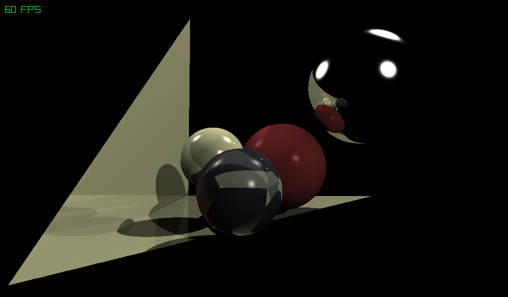

#  TinyRayTracer *
___ 

**Small RayTracing using raylib and GLSL**

This is a small program designed to demonstrate how Ray Tracing works in a simple way. Using raylib to access OpenGL API, it serves as an example for understanding the basics of Ray Tracing. While not remotly optimized, it can be a helpful reference if needed.

___

**Build process**

To build the program you need CMake. In the project folder, run the following command in your terminal:

`mkdir buid`

`cmake -S . -B build` 

Once CMake finishes creating the cache, navegate to the source directory and run: 

`cmake --build ../build` 

When the process is complete, you can execute the program located at build/TinyRayTracer-RAYLIB/
